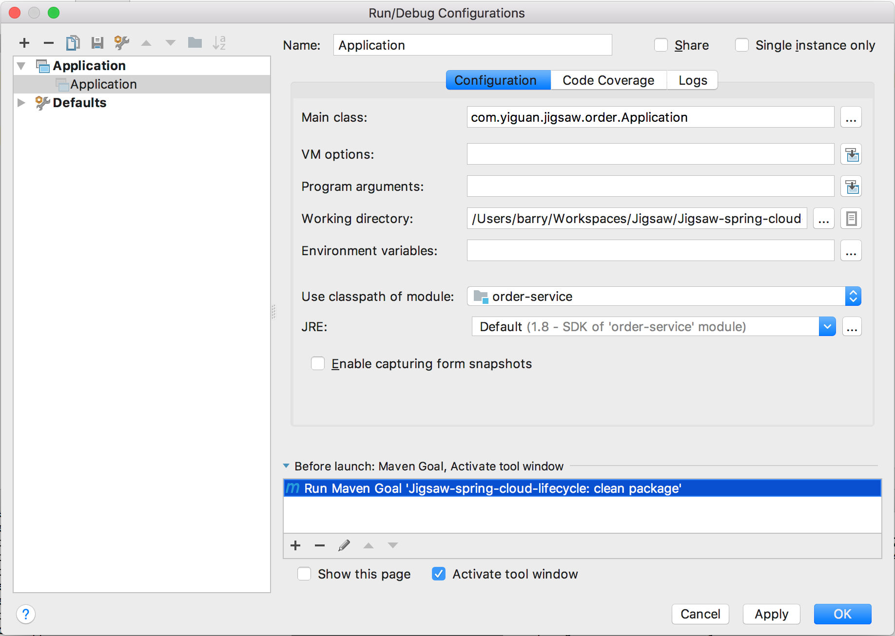

# Jigsaw-spring-cloud-lifecycle
该项目旨在利用Spring Cloud + Lifecycle + JPA技术栈给出偏向领域微服务的

## 运行/调试程序之前的准备
### 启动服务依赖容器
在工程目录下执行
```
    docker-compose up
```

### 配置IntelliJ 启动 Order Service

如下图所示，需要在Before Launch对话框内移除"Build"并且添加Maven任务clean package


## 启动


